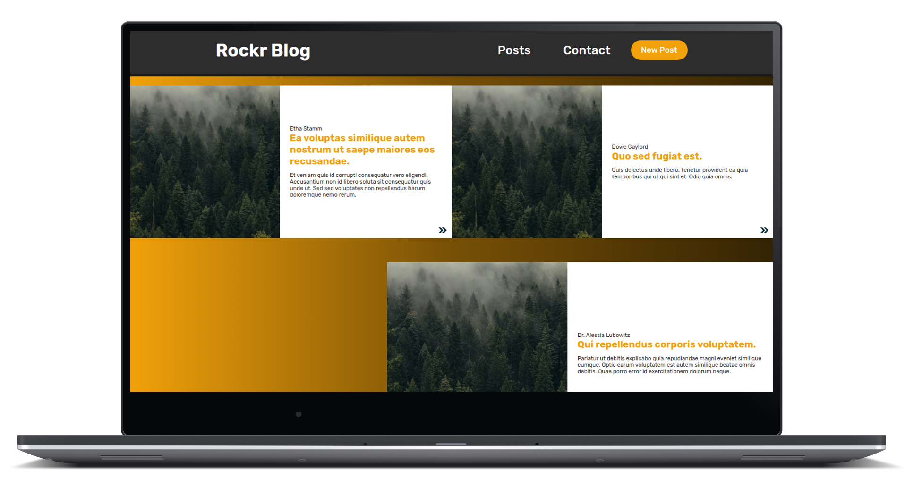
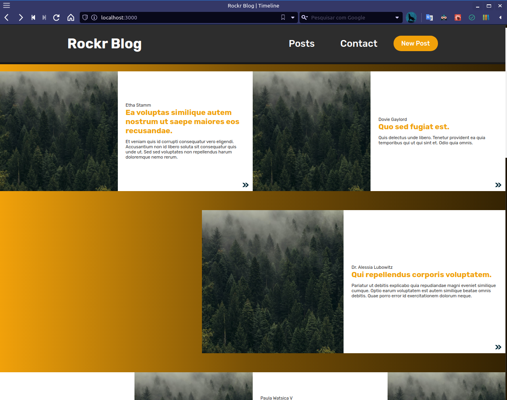
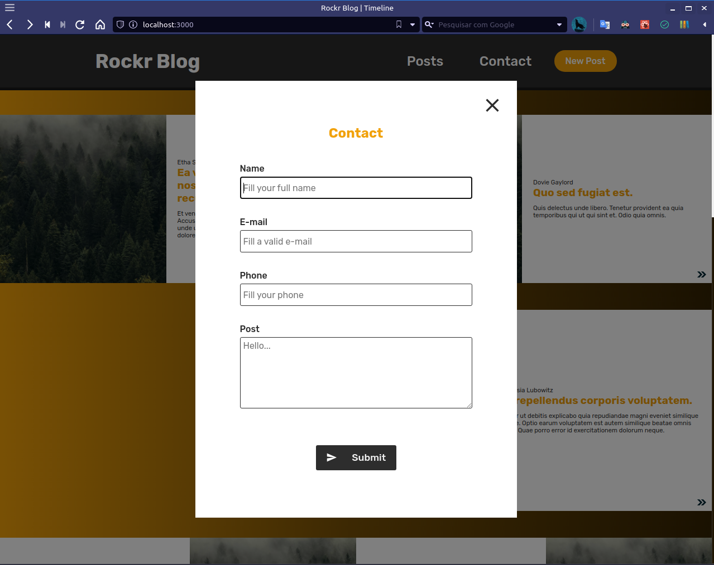
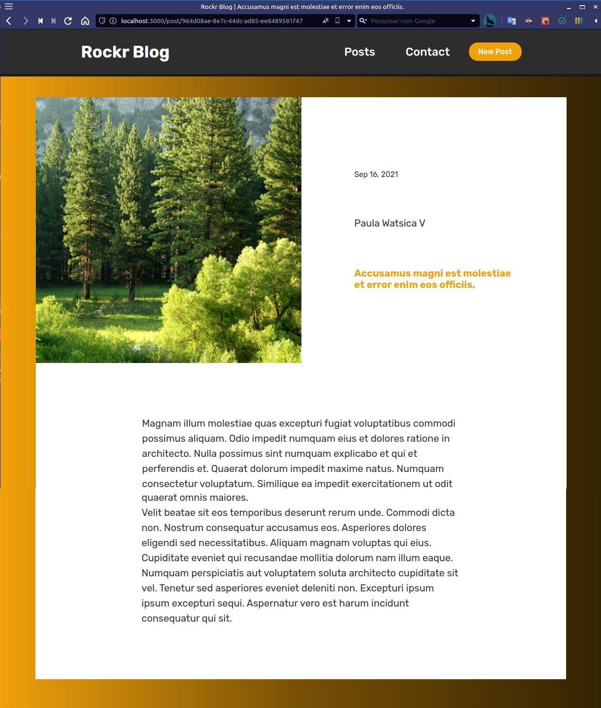
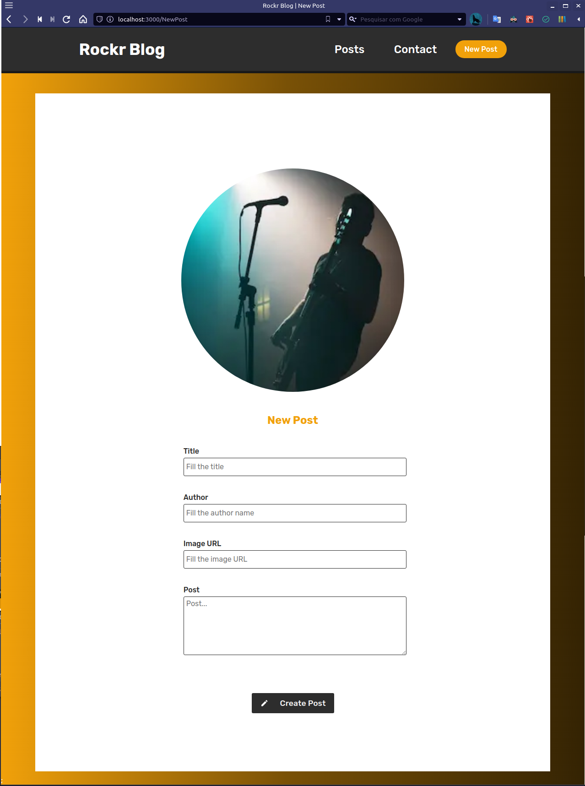

<div  align="center">
  
<h1  align="center"  >Rockr Blog</h1>


</div>

<div align="center">

<br>

<p align="center">
  <strong>
      <a href="#-technologies">Technologies</a> &nbsp;|&nbsp; 
  </strong>
  <strong>
      <a href="#-how-to-run-the-project">Running</a> &nbsp;|&nbsp; 
  </strong>
  <strong>
      <a href="#-screenshots">Scheenshots</a> &nbsp;|&nbsp; 
  </strong>
</p>

<p align="center">
  
</p>
</div>

## **💻 Technologies**

#### **Website** ([React][react])

- **[Next:][next]**
  <br>
  <span>
  With this tool you can control when a page should be rendered statically or dynamically and also lets you run server-side functions before rendering the page.
  </span>
  <br>

- **[Typescript:][typescript]**
  <br>
  <span>
  Typescript is used a lot these days and helps the programmer to make less errors when manipulating variables.
  </span>
  <br>

- **[React Hook Form][react_hook_form]**
  <br>
  <span>
  A form library makes forms more efficient and validations can be done.
  </span>
  <br>

- **[Yup:][yup]**
  <br>
  <span>
  Yup complements the "React Hook Form" with validations to form.
  </span>
  <br>

- **[Sass][sass]**
  <br>
  <span>
  Sass is a very popular pré-processador CSS these days, with it we can use a hierarchical syntax that is easier to manipulate.
  </span>
  <br>
- **[CSS Modules][css_modules]**
  <br>
  <span>
  CSS modules prevents a class from conflicting with another class from another component in React.
  </span>
  <br>
  <br>

> \* See the file <kbd>[package.json](./package.json)</kbd>

---

## **🚀 How to run the project**

### Initial Settings:

First, you need to have <kbd>[NodeJS](https://nodejs.org/en/download/)</kbd> installed on your machine.

You need to choose a package manager for the installs, you can choose **yarn** or **npm**. You can install it by clicking here: <kbd>[yarn][yarn]</kbd>, or here: <kbd>[npm][npm]</kbd>.

After having **Node** installed, install the **React** dependencies globally, using the commands:

Install the dependencies contained in the `package.json` files found at the root of the repository. To install the dependencies, just open the terminal in the directory and type the command:

```sh
# Installing dependencies:
$ npm install

#  or

$ yarn
```

> See the **scripts {}** in <kbd>[package.json](./package.json)</kbd> file for what scripts are available.

<br/>

### Running the Website:

```sh
# For run:
$ npm run dev

#    or

$ yarn dev
```

<br/>

> If the browser does not open automatically, go to: http://localhost:3000.

<br/>

---

## **🔖 Screenshots**

  <div>
    
    <br/>
    <br/>
    
    <br/>
    <br/>
    
    <br/>
    <br/>
    
  <div>

---

<!-- Techs -->

[react]: https://reactjs.org/
[node]: https://nodejs.org/en/
[typescript]: https://www.typescriptlang.org/
[css_modules]: https://github.com/css-modules/css-modules
[react_hook_form]: https://react-hook-form.com
[yup]: https://github.com/jquense/yup
[sass]: https://sass-lang.com
[next]: https://nextjs.org
[npm]: https://www.npmjs.com/package/yup
[yarn]: https://classic.yarnpkg.com/en/docs/install/#debian-stable
